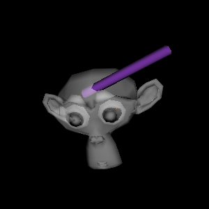

===============
Getting Started
===============

Start by importing FURY.

.. code-block:: python

    import numpy as np
    from fury import window, actor, ui, io, utils

To import a model, use :py:func:`.io.load_polydata`. Currently supported formats include OBJ, VTK, FIB, PLY, STL and XML.

Here we are going to use ``suzanne`` model used by Blender. You can find more detail about what is suzanne model `here <https://en.wikipedia.org/wiki/Blender_(software)#:~:text=A%20low-polygon%20model%20with%20only%20500%20faces%2C%20Suzanne,gives%20out%20an%20award%20called%20the%20Suzanne%20Award.).>`_.

We can download the model by

.. code-block:: python

    from fury.data import fetch_viz_models
    fetch_viz_models()
    
The models will be downloaded in ``~/.fury/models`` directory.

If you store the return value to ``models``, you can find the detailed information about models in the dictionary. The directory of the ``suzanne`` model will be in ``models[1]``.

.. code-block:: python

    models = fetch_viz_models()
    print(models[1])
    
To get the path of suzanne

.. code-block:: python

    import os
    path_suzanne = os.path.join(models[1], 'suzanne.obj')
    print(path_suzanne)

Now we can include the ``suzanne`` model used by Blender:

.. code-block:: python

    suzanne = io.load_polydata('suzanne.obj')
    suzanne = utils.get_polymapper_from_polydata(suzanne)
    suzanne = utils.get_actor_from_polymapper(suzanne)

Set the opacity of the model::

    suzanne.GetProperty().SetOpacity(0.5)

Let's create some random variables for the cylinder parameters

.. code-block:: python

    centers = np.random.rand(2, 3)
    directions = np.random.rand(2, 3)
    heights = np.random.rand(2)
    colors = np.random.rand(2, 3)

Now, we create a cylinder::

    cylinders = actor.cylinder(centers, directions, colors, heights=heights)

Anything that has to be rendered needs to be added to the scene so let's create a :py:class:`.Scene()`::

    scene = window.Scene()

We set the window scene variables e.g. (width, height)::

    showm = window.ShowManager(scene, size=(1024,720), reset_camera=False)

We add a text block to add some information::

    tb = ui.TextBlock2D(position=(450, 550), font_size=23)
    tb.message = "Hello Fury"

The function :py:meth:`.Scene.add()` is used to add the created objects to the scene to be rendered::

    scene.add(suzanne)
    scene.add(cylinders)
    scene.add(tb)

Start the rendering of the scene::

    showm.start()

