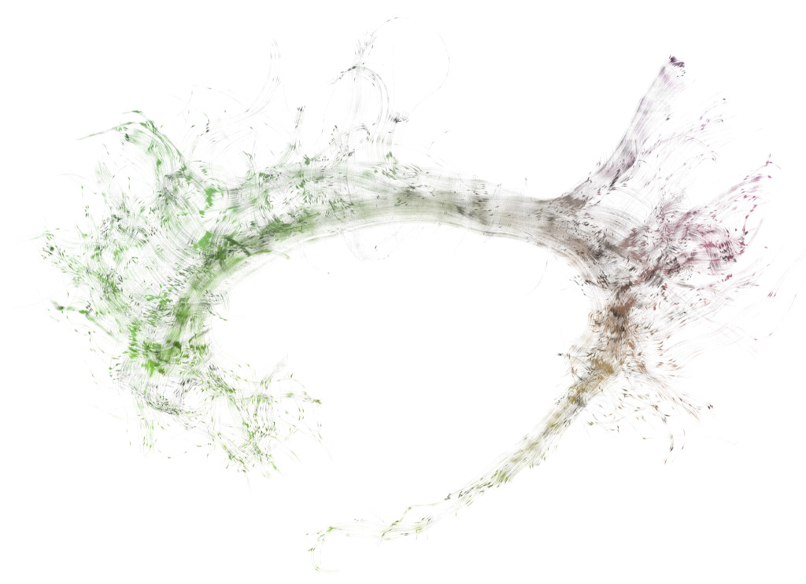

Success on Brain Art Competition using FURY
===========================================

.. post:: June 19 2019
   :author: skoudoro
   :tags: shader
   :category: news

Congratulations to `David <https://github.com/dmreagan>`_ who won the `OHBM BrainArt (MELPOMENE category) <https://www.neurobureau.org/galleries/brain-art-competition-2019-2/>`_ by using DIPY and FURY!!!

As you can see below, really beautiful streamlines effect created during shader experiment/fail!

